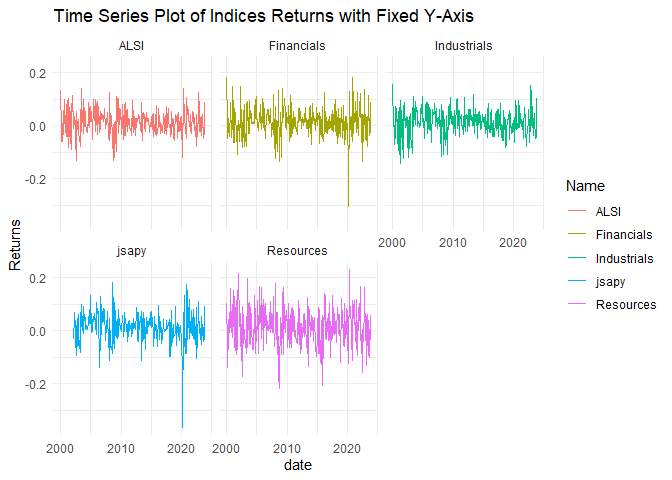
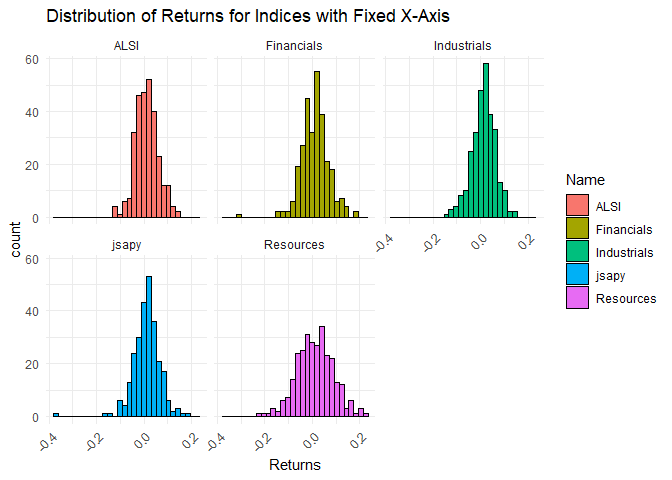
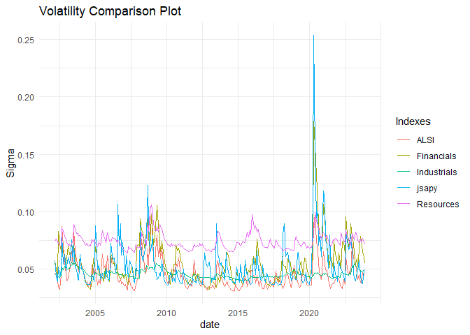
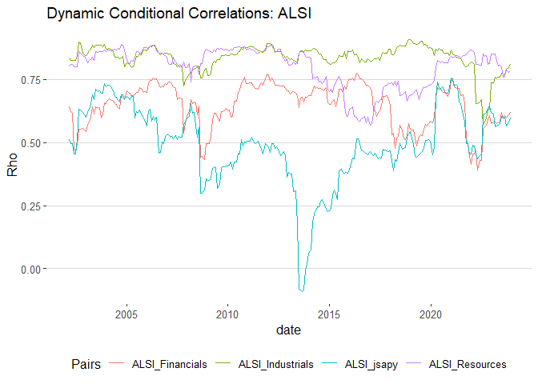
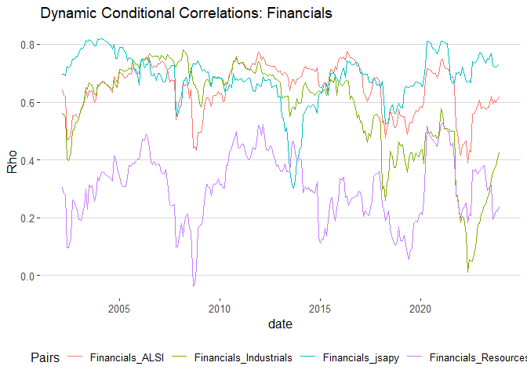
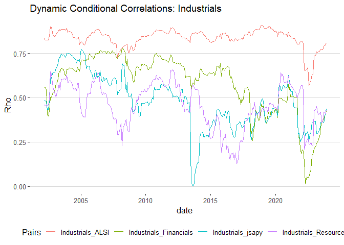
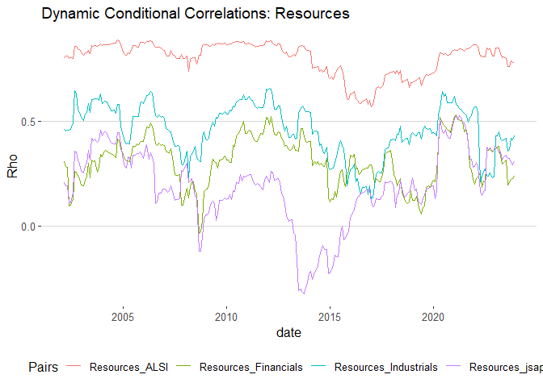
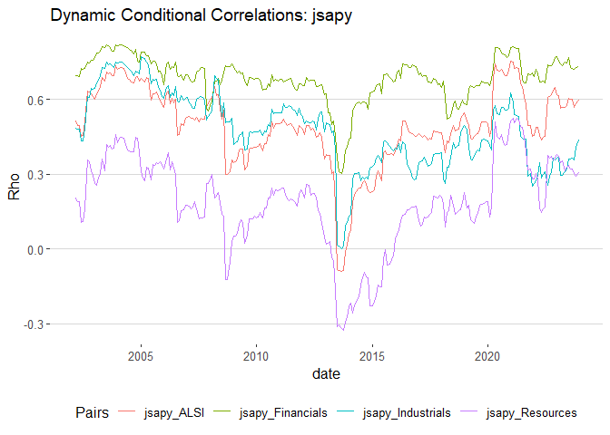

# Purpose

The purpose of this readme is to provide a breakdown of my thought
process while completing this volatility modeling project. In this
readme I will explain what and why I am doing what I am doing to provide
a clear structure for this project.

``` r
rm(list = ls()) # Clean your environment:
gc() # garbage collection - It can be useful to call gc after a large object has been removed, as this may prompt R to return memory to the operating system.
```

    ##          used (Mb) gc trigger (Mb) max used (Mb)
    ## Ncells 468247 25.1    1007655 53.9   660385 35.3
    ## Vcells 869811  6.7    8388608 64.0  1769691 13.6

``` r
library(tidyverse)
```

    ## ── Attaching core tidyverse packages ──────────────────────── tidyverse 2.0.0 ──
    ## ✔ dplyr     1.1.3     ✔ readr     2.1.4
    ## ✔ forcats   1.0.0     ✔ stringr   1.5.0
    ## ✔ ggplot2   3.4.4     ✔ tibble    3.2.1
    ## ✔ lubridate 1.9.3     ✔ tidyr     1.3.0
    ## ✔ purrr     1.0.2     
    ## ── Conflicts ────────────────────────────────────────── tidyverse_conflicts() ──
    ## ✖ dplyr::filter() masks stats::filter()
    ## ✖ dplyr::lag()    masks stats::lag()
    ## ℹ Use the conflicted package (<http://conflicted.r-lib.org/>) to force all conflicts to become errors

``` r
list.files('code/', full.names = T, recursive = T) %>% .[grepl('.R', .)] %>% as.list() %>% walk(~source(.))
```

# Loading relevant packages

Here I am loading the relevant packages that I will be using throughout
this analysis.

``` r
#Loading all relevant packages. 
#install.packages("pacman")
pacman::p_load(tidyverse)
pacman::p_load(readxl)
pacman::p_load(readr)
pacman::p_load(ggplot2)
pacman::p_load(gt)
pacman::p_load(dplyr)
pacman::p_load("MTS", "robustbase")
pacman::p_load("devtools", "rugarch", "rmgarch", 
    "forecast", "tbl2xts", "lubridate", "PerformanceAnalytics", 
    "ggthemes")
library(MTS)
library(robustbase)
library(gt)
library(tidyverse)
library(dplyr)
library(lubridate)
library(zoo)
library(tidyr)
library(tseries)
library(PortfolioAnalytics)
library(ggplot2)
library(RcppRoll)
library(tbl2xts)
library(fmxdat)
library(rmsfuns)
library(PerformanceAnalytics)
```

# Loading relevant data

The following data is loaded into R. I have loaded LCL_Indicies and
LCL_Stock_Returns data sets, however, I am unsure of which data set I
will use for this volatility analysis. This will be decided when doing
some further analysis below.

The LCL_Stock_Returns data set is giving me issues when publishing to
GitHub that is why i have commented it out here. This makes no
difference to my project as I dont end up using that data set in any
analysis.

``` r
LCL_Indices <- readRDS("C:/Users/austi/OneDrive/Desktop/Masters/Financial Econometrics/Project/DCC_GARCH_volatility_model/data/LCL_Indices (1).rds")
#LCL_Stock_Returns <- readRDS("C:/Users/austi/OneDrive/Desktop/Masters/Financial Econometrics/Project/DCC_GARCH_volatility_model/data/LCL_Stock_Returns (1).rds")
```

# Data

## Data overview

The two data sets that I am using in the analysis is that of the
LCL_Indices data set, which contains information on the returns for
differing indexes such as the SWIX, ALSI, Capped SWIX, Top 40, SWIX Top
40, Capped SWIX Top 40, CAPI, Capped Top 40, Industrials, Financials,
Resources, albi and jsapy. The second data set that I am evaluating is
the LCL_Stock_Returns data set. Which also provides the returns for
differing stock in differing indexes.

## Checking for missing values

Before continuing with this analysis it is imperative that I evaluate
the data at hand. Firstly I want to look at whether there are any
missing values in the two data sets that I have imported into R. If so I
need to find an appropriate way of dealing with these missing values.

``` r
#Checking how many total observations we have
nrow(LCL_Indices)
```

    ## [1] 4281

``` r
# For LCL_Indices data set
sum(is.na(LCL_Indices))
```

    ## [1] 602

``` r
# For LCL_Stock_Returns data set
#sum(is.na(LCL_Stock_Returns))
```

From the above code, it is evident that the LCL_Indices data set has 602
missing values and the LCL_Stock_Returns data set has 2 400 432 missing
values. Due to the large amount of missing values in the
LCL_Stock_Returns data set I will focus my analysis on the LCL_Indices
data set. Even though this data set has fewer missing values, I still
need to deal with them appropriately.

Given that we have 4281 total observations is not drastically
substantial, I will therefore remove all rows containing NA’s. This
should still leave us with a sufficient amount of observations to
conduct our volatility analysis.

``` r
#Creating a new cleaned data set that has no NA's 
LCL_Indices_Cleaned <- na.omit(LCL_Indices)

#Evaluating whether the NA's have been removed successfully
sum(is.na(LCL_Indices_Cleaned))
```

    ## [1] 0

``` r
#Evaluating the amount of data still available
nrow(LCL_Indices_Cleaned)
```

    ## [1] 3679

The NA’s have now successfully been removed and we can continue with the
analysis.

# Methodology

The main aim of this analysis is to evaluate the relationship between
different indices and evaluate how they move with respect to each other.
This information can be vitally important in portfolio creation as one
can better diversify their portfolio and reduce risk exposure.

## Evaluating correlation

When attempting to use a GARCH model to evaluate the relationship
between different time series, as in this project, it is important to do
a correlation analysis. The purpose of this correlation analysis is to
identify any multicolinearity issue and for me to better understand the
market dynamics. Additionally when running the GARCH models we may run
into issues with the cholseky decompostion if we use variables that are
too highly correlated.

### Reshaping the data

Here I am reshaping the cleaned data from a long format to a wide format
using the spread function, to make it easier for me to do the
correlation analysis.

``` r
# Reshaping the LCL_Indices_Cleaned data to a wide format
LCL_Indices_wide <- LCL_Indices_Cleaned %>%
  select(date, Name, Returns) %>%
  spread(Name, Returns)
```

### Calculating the correlation matrix

In this code chunk I run the correlation analysis using the cor
function. Here I exclude the date column because it is not needed when
running the correlation matrix. In this next code chunk I will attempt
to write code that will identify highly correlated index pairs. Then I
will be able to make a better decision on which index pairs to evaluate
in the volatility model.

``` r
# Calculating the correlation matrix for index returns
cor_matrix <- cor(LCL_Indices_wide[,-1], use = "complete.obs")

cor_matrix
```

    ##                            albi      ALSI      CAPI Capped SWIX
    ## albi                1.000000000 0.1827901 0.2184680   0.3099975
    ## ALSI                0.182790140 1.0000000 0.9960333   0.9644376
    ## CAPI                0.218468013 0.9960333 1.0000000   0.9749679
    ## Capped SWIX         0.309997503 0.9644376 0.9749679   1.0000000
    ## Capped SWIX Top 40  0.258890586 0.9711351 0.9779286   0.9908881
    ## Capped Top 40       0.183853483 0.9934433 0.9958932   0.9621418
    ## Financials          0.507490035 0.6681745 0.7049883   0.7992438
    ## Industrials         0.169862121 0.8346084 0.8319518   0.8223491
    ## jsapy               0.519043393 0.5039411 0.5353729   0.6150155
    ## Resources          -0.005256548 0.8212035 0.8112582   0.7179993
    ## SWIX                0.287908652 0.9684627 0.9721135   0.9938434
    ## SWIX Top 40         0.232802892 0.9732879 0.9714649   0.9799261
    ## Top 40              0.135262172 0.9949476 0.9866381   0.9409715
    ##                    Capped SWIX Top 40 Capped Top 40 Financials Industrials
    ## albi                        0.2588906     0.1838535  0.5074900   0.1698621
    ## ALSI                        0.9711351     0.9934433  0.6681745   0.8346084
    ## CAPI                        0.9779286     0.9958932  0.7049883   0.8319518
    ## Capped SWIX                 0.9908881     0.9621418  0.7992438   0.8223491
    ## Capped SWIX Top 40          1.0000000     0.9757589  0.7706458   0.8221173
    ## Capped Top 40               0.9757589     1.0000000  0.6813783   0.8294386
    ## Financials                  0.7706458     0.6813783  1.0000000   0.5698988
    ## Industrials                 0.8221173     0.8294386  0.5698988   1.0000000
    ## jsapy                       0.5550132     0.4913973  0.7260542   0.4575543
    ## Resources                   0.7360012     0.8204346  0.3377222   0.4692706
    ## SWIX                        0.9869097     0.9605816  0.7711485   0.8477405
    ## SWIX Top 40                 0.9893225     0.9705907  0.7307805   0.8524058
    ## Top 40                      0.9596793     0.9922064  0.6242513   0.8304613
    ##                        jsapy    Resources      SWIX SWIX Top 40    Top 40
    ## albi               0.5190434 -0.005256548 0.2879087   0.2328029 0.1352622
    ## ALSI               0.5039411  0.821203536 0.9684627   0.9732879 0.9949476
    ## CAPI               0.5353729  0.811258171 0.9721135   0.9714649 0.9866381
    ## Capped SWIX        0.6150155  0.717999272 0.9938434   0.9799261 0.9409715
    ## Capped SWIX Top 40 0.5550132  0.736001226 0.9869097   0.9893225 0.9596793
    ## Capped Top 40      0.4913973  0.820434613 0.9605816   0.9705907 0.9922064
    ## Financials         0.7260542  0.337722156 0.7711485   0.7307805 0.6242513
    ## Industrials        0.4575543  0.469270610 0.8477405   0.8524058 0.8304613
    ## jsapy              1.0000000  0.225518221 0.5877776   0.5188877 0.4455886
    ## Resources          0.2255182  1.000000000 0.7120705   0.7289365 0.8317506
    ## SWIX               0.5877776  0.712070523 1.0000000   0.9914839 0.9488782
    ## SWIX Top 40        0.5188877  0.728936525 0.9914839   1.0000000 0.9662434
    ## Top 40             0.4455886  0.831750650 0.9488782   0.9662434 1.0000000

### Identifying Highly Correlated Indices

To identify indices that are highly correlated, which could indicate
similar movements:

``` r
# Setting a threshold for identifying high correlations
high_corr_threshold <- 0.9

# Finding index pairs with correlations above the threshold
high_corr_indices <- which(abs(cor_matrix) > high_corr_threshold, arr.ind = TRUE)

# Excluding self-correlation (diagonal elements)
high_corr_indices <- high_corr_indices[high_corr_indices[, 1] != high_corr_indices[, 2], ]

# Ensuring unique pairs are identified to avoid duplication
unique_high_corr_indices <- unique(t(apply(high_corr_indices, 1, sort)))

# Associating the indices names with the high correlation pairs
high_corr_pairs <- apply(unique_high_corr_indices, 1, function(idx) {
  return(colnames(cor_matrix)[idx])
})

# The resulting pairs are as follows:
high_corr_pairs
```

    ##      CAPI   Capped SWIX   Capped SWIX Top 40   Capped Top 40   SWIX  
    ## [1,] "ALSI" "ALSI"        "ALSI"               "ALSI"          "ALSI"
    ## [2,] "CAPI" "Capped SWIX" "Capped SWIX Top 40" "Capped Top 40" "SWIX"
    ##      SWIX Top 40   Top 40   Capped SWIX   Capped SWIX Top 40   Capped Top 40  
    ## [1,] "ALSI"        "ALSI"   "CAPI"        "CAPI"               "CAPI"         
    ## [2,] "SWIX Top 40" "Top 40" "Capped SWIX" "Capped SWIX Top 40" "Capped Top 40"
    ##      SWIX   SWIX Top 40   Top 40   Capped SWIX Top 40   Capped Top 40  
    ## [1,] "CAPI" "CAPI"        "CAPI"   "Capped SWIX"        "Capped SWIX"  
    ## [2,] "SWIX" "SWIX Top 40" "Top 40" "Capped SWIX Top 40" "Capped Top 40"
    ##      SWIX          SWIX Top 40   Top 40        Capped Top 40       
    ## [1,] "Capped SWIX" "Capped SWIX" "Capped SWIX" "Capped SWIX Top 40"
    ## [2,] "SWIX"        "SWIX Top 40" "Top 40"      "Capped Top 40"     
    ##      SWIX                 SWIX Top 40          Top 40              
    ## [1,] "Capped SWIX Top 40" "Capped SWIX Top 40" "Capped SWIX Top 40"
    ## [2,] "SWIX"               "SWIX Top 40"        "Top 40"            
    ##      SWIX            SWIX Top 40     Top 40          SWIX Top 40   Top 40  
    ## [1,] "Capped Top 40" "Capped Top 40" "Capped Top 40" "SWIX"        "SWIX"  
    ## [2,] "SWIX"          "SWIX Top 40"   "Top 40"        "SWIX Top 40" "Top 40"
    ##      Top 40       
    ## [1,] "SWIX Top 40"
    ## [2,] "Top 40"

Here I decided that a correlation above 0.9 relates to indexes which are
strongly correlated and which may provide issues latter on in the
analysis. I take this information into consideration in my next section
where I select which indexes to use in this analysis.

## Data Selection

### Index selection

Based on the information obtained from the correlation analysis above I
select the ALSI, Financials, Industrials, jsapy, Resources as the
indexes I will conduct my volatility analysis on. Not only are these
indexes not highly correlated but also will prove a broad view of the
overall market.

``` r
# Defining the indices to include in the analysis
selected_indices <- c("ALSI", "Financials", "Industrials", "jsapy", "Resources")

# Filtering the data set to keep only the selected indices
LCL_Indices_Selected <- LCL_Indices_Cleaned %>%
  filter(Name %in% selected_indices)
```

The cleaned data set is now altered to only include the above mentioned
variables. The LCL_Indicies_Selected data frame will be used for further
analysis.

# Data Visualization

## Time Series Analysis of Returns

In this next section I aim to visually analyse the return structure of
the selected indexes. I do this by plotting time series plots of their
respective returns. Through these plots I am able to see which indexes
have the highest volatility in returns and visualize period of low and
high returns.

``` r
# Using ggplot2 to create time series plots of the selected indices' returns
Index_return_plot <- ggplot(LCL_Indices_Selected, aes(x = date, y = Returns, color = Name)) + 
  geom_line() + 
  facet_wrap(~Name, scales = "fixed") +  # Ensures comparable y-axis scales across facets
  theme_minimal() +
  ggtitle("Time Series Plot of Indices Returns with Fixed Y-Axis")

# Displaying the plot
Index_return_plot
```

 The
facet_wrap function is used with scales = “fixed” to ensure that each
index is plotted with the same y-axis scale, making it easier to compare
the relative volatility and magnitude of returns across different
indices.

## Analyzing the Distribution of Returns

In an attempt to add to the analysis done above with respect to the
return structure I plot the distribution of returns for each index
through a histogram plot. Here I will be able to visualize whether there
are any fat tails or skewed returns in any of the series.

``` r
# Creating histograms for the distribution of returns for each index
Return_distribution_hist <- ggplot(LCL_Indices_Selected, aes(x = Returns, fill = Name)) + 
  geom_histogram(bins = 30, color = "black") +
  facet_wrap(~Name, scales = "fixed") +  # Fixed scales for x-axis across facets
  theme_minimal() +
  theme(axis.text.x = element_text(angle = 45, hjust = 1)) +  # Tilting x-axis labels for readability
  ggtitle("Distribution of Returns for Indices with Fixed X-Axis")

Return_distribution_hist
```



In this plot:

-Bins: Set to 30 to balance the granularity and readability of the
histogram. -Facet Wrap: Used with scales = “fixed” to ensure the x-axis
(representing returns) is consistently scaled across different indices,
allowing for direct comparison. -Axis Text: The x-axis labels are tilted
for better readability, especially useful when dealing with numerous
data points or overlapping labels.

This histogram provides insights into the typical range of returns and
the presence of any extreme values, which is valuable for understanding
the risk profile associated with each index.

# Time Range Specification and Data Filtering

## Determining Date Ranges for Each Index

A main step in this analysis requires me to transform my data to xts
format. In doing so if not all the data runs through the same dates,
NA’s will be produced and thus hinder my analysis. I therefore use the
following code to evaluate the date range for each index. I am then able
to wrangle the data to ensure all the indexes data starts and ends on
the same date.

``` r
# Calculating the date range for each index
date_ranges <- LCL_Indices_Selected %>%
  group_by(Name) %>%
  summarize(Start_Date = min(date, na.rm = TRUE),
            End_Date = max(date, na.rm = TRUE))

# Viewing the date ranges
date_ranges
```

    ## # A tibble: 5 × 3
    ##   Name        Start_Date End_Date  
    ##   <chr>       <date>     <date>    
    ## 1 ALSI        1999-12-31 2023-11-30
    ## 2 Financials  1999-12-31 2023-11-30
    ## 3 Industrials 1999-12-31 2023-11-30
    ## 4 Resources   1999-12-31 2023-11-30
    ## 5 jsapy       2002-01-31 2023-11-30

## Consistent Time Range for Analysis

Given the results from above I state a start and end date of 2002-02-28
and 2023-11-30 repectively. This will ensure that there are no NA’s
produced when the data is transformed to xts.

``` r
# Defining a consistent time range for the analysis
start_date <- as.Date("2002-02-28")  # Start date
end_date <- as.Date("2023-11-30")    # End date

# Filtering the data set for the defined time range
LCL_Indices_Filtered <- LCL_Indices_Selected %>%
  filter(date >= start_date & date <= end_date)
```

# Time Series Conversion and Preliminary Testing

## Converting Data to Time Series Format

As mentioned when working with GARCH models is very important to
transform the data to xts. To do this I make use of the tbl2xts package.

``` r
# Loading necessary libraries
pacman::p_load("tbl2xts", "MTS")

# Converting the filtered dataset to an xts object for time series analysis
xts_rtn <- LCL_Indices_Filtered %>% tbl_xts(., cols_to_xts = "Returns", spread_by = "Name")
```

## Preliminary Testing for ARCH Effects

Before I fit any GARCH models to my data I need evaluate the presence of
any ARCH effects. If there are no ARCH effects present, it does not make
sense to run any GARCH models for this volatility analysis. To test for
ARCH effects I perform the McLeod-Li test. This test checks for
autoregressive conditional heteroskedasticity (ARCH) in the time series
data. If present the p-values will be very close to 0, indicating that
the volatility within the variables changes over time. Thus, it is
viable to use GARCH models.

``` r
# Performing the McLeod-Li test to check for ARCH effects
MarchTest(xts_rtn)
```

    ## Q(m) of squared series(LM test):  
    ## Test statistic:  44.88386  p-value:  2.282185e-06 
    ## Rank-based Test:  
    ## Test statistic:  108.2555  p-value:  0 
    ## Q_k(m) of squared series:  
    ## Test statistic:  341.5009  p-value:  0.000104816 
    ## Robust Test(5%) :  321.4297  p-value:  0.001529345

# Advanced Volatility Modeling

## Preprocessing for DCC-GARCH Model

In this section I aim to use the DCC-GARCH model to conduct a volatility
modeling analysis of the selected Indexes. To do so I need to first pre
process the xts data using the dccPre function from the rmgarch package.

``` r
# Loading the rmgarch library for advanced GARCH modeling
library(rmgarch)
```

    ## Loading required package: rugarch

    ## Loading required package: parallel

    ## 
    ## Attaching package: 'rugarch'

    ## The following object is masked from 'package:purrr':
    ## 
    ##     reduce

    ## The following object is masked from 'package:stats':
    ## 
    ##     sigma

    ## 
    ## Attaching package: 'rmgarch'

    ## The following objects are masked from 'package:dplyr':
    ## 
    ##     first, last

``` r
# Preprocessing the data using dccPre function from rmgarch
# This includes specifying that the mean of each series is included in the model (include.mean = TRUE)
# and setting the autoregressive order for the mean equation to zero (p = 0)
DCCPre <- dccPre(xts_rtn, include.mean = TRUE, p = 0) 
```

    ## Sample mean of the returns:  0.01129613 0.01319642 0.01136441 0.009198982 0.01111437 
    ## Component:  1 
    ## Estimates:  0.000415 0.302713 0.523953 
    ## se.coef  :  0.000237 0.127268 0.1809 
    ## t-value  :  1.754115 2.378551 2.896363 
    ## Component:  2 
    ## Estimates:  0.000176 0.042197 0.875056 
    ## se.coef  :  0.000267 0.041345 0.153012 
    ## t-value  :  0.656965 1.020592 5.718878 
    ## Component:  3 
    ## Estimates:  0.000331 0.28408 0.645288 
    ## se.coef  :  0.000178 0.097319 0.104902 
    ## t-value  :  1.857353 2.919062 6.151335 
    ## Component:  4 
    ## Estimates:  0.000986 0.079766 0.742498 
    ## se.coef  :  0.000699 0.05649 0.144354 
    ## t-value  :  1.4102 1.412038 5.143584 
    ## Component:  5 
    ## Estimates:  0.000863 0.415252 0.334135 
    ## se.coef  :  0.000266 0.116508 0.129269 
    ## t-value  :  3.24526 3.564142 2.584803

In this preprocessing step:

-   include.mean = TRUE ensures that the mean of each time series is
    considered in the model.
-   p = 0 indicates that we are not using past values of the series (no
    autoregressive terms) in the mean equation.

# Volatility Estimates Extraction

With the preprocessing completed, we now extract the volatility
estimates for each time series:

``` r
# Loading necessary library
pacman::p_load("zoo")

# Extracting the marginal volatilities from the DCC preprocessing output
Vol <- DCCPre$marVol
colnames(Vol) <- colnames(xts_rtn)

# Converting to a data frame and adding the date column back
Vol <- data.frame(cbind(date = index(xts_rtn), Vol)) %>%
  mutate(date = as.Date(date)) %>%  # Convert to Date format
  tbl_df()
```

    ## Warning: `tbl_df()` was deprecated in dplyr 1.0.0.
    ## ℹ Please use `tibble::as_tibble()` instead.
    ## Call `lifecycle::last_lifecycle_warnings()` to see where this warning was
    ## generated.

``` r
# Reshaping the data for plotting
TidyVol <- Vol %>% gather(Indexes, Sigma, -date)
```

## Visualizing Volatility Estimates

To compare the volatility of each index, we create a plot showing the
time series of volatilities:

``` r
# Creating the volatility comparison plot
Volatility_Comparison_Plot <- ggplot(TidyVol, aes(x = date, y = Sigma, colour = Indexes)) +
  geom_line() +
  theme_minimal() +
  ggtitle("Volatility Comparison Plot")  # Adding a title to the plot

# Displaying the plot
print(Volatility_Comparison_Plot)
```



This plot provides a visual comparison of how the volatility of each
index has evolved over time, highlighting periods of heightened or
reduced market uncertainty.

## Preparing for DCC Model Fitting

When fitting the DCC model it is crucial to have the standardized
residuals. Thus, they are extracted as follows.

To fit the DCC model on the standardized residuals in use the dccFit
function. However, it is importnat to note that you have to detach the
tidyverse and tbl2xts packages from your environment because these
packages create clashes in the code if still loaded.

``` r
# Extracting standardized residuals from the DCC preprocessing output
StdRes <- DCCPre$sresi

# Detaching packages that clash with the dccFit package. 
detach("package:tidyverse", unload=TRUE)
detach("package:tbl2xts", unload=TRUE)

# Fitting the DCC model to the standardized residuals
DCC <- dccFit(StdRes, type="Engle")
```

    ## Estimates:  0.923453 0.049999 6.740648 
    ## st.errors:  0.01724525 0.009844746 0.9307735 
    ## t-values:   53.54826 5.07875 7.241985

## Reinitializing Required Packages

Once I have fit the DCC model on the standardized residuals I am able to
reload the tidyverse and tbl2xts packages back into the environment.

``` r
# Reloading tidyverse, tbl2xts, and broom packages
pacman::p_load("tidyverse", "tbl2xts", "broom")
```

## Processing DCC Model Output

Here I extract the rho variable from the results which illustrates
correlation and make use of a function to increase interpretability and
process the results.

``` r
# Extracting time-varying correlations from the DCC model
Rhot <- DCC$rho.t

# Function to rename and reformat the DCC correlations for visualization
renamingdcc <- function(ReturnSeries, DCC.TV.Cor) {
    ncolrtn <- ncol(ReturnSeries)
    namesrtn <- colnames(ReturnSeries)

    nam <- c()
    xx <- mapply(rep, times = ncolrtn:1, x = namesrtn)

    for (j in 1:(ncolrtn)) {
        for (i in 1:(ncolrtn)) {
            nam[(i + (j-1)*(ncolrtn))] <- paste(xx[[j]][1], xx[[i]][1], sep="_")
        }
    }

    colnames(DCC.TV.Cor) <- nam
    DCC.TV.Cor <- data.frame(cbind(date = index(ReturnSeries), DCC.TV.Cor)) %>%
        mutate(date = as.Date(date)) %>% tbl_df()
    DCC.TV.Cor <- DCC.TV.Cor %>% gather(Pairs, Rho, -date)

    return(DCC.TV.Cor)
}

# Applying the renaming function to the DCC correlations
Rhot <- renamingdcc(ReturnSeries = xts_rtn, DCC.TV.Cor = Rhot)
```

    ## Warning: `tbl_df()` was deprecated in dplyr 1.0.0.
    ## ℹ Please use `tibble::as_tibble()` instead.
    ## Call `lifecycle::last_lifecycle_warnings()` to see where this warning was
    ## generated.

``` r
# Displaying the first few rows of the processed correlations
head(Rhot %>% arrange(date))
```

    ## # A tibble: 6 × 3
    ##   date       Pairs              Rho
    ##   <date>     <chr>            <dbl>
    ## 1 2002-02-28 ALSI_ALSI        1    
    ## 2 2002-02-28 ALSI_Industrials 0.834
    ## 3 2002-02-28 ALSI_Financials  0.643
    ## 4 2002-02-28 ALSI_Resources   0.802
    ## 5 2002-02-28 ALSI_jsapy       0.512
    ## 6 2002-02-28 Industrials_ALSI 0.834

# Results

## Visualizing Dynamic Conditional Correlations

TO provide visualization into market dynamics I plot the Dynamic
correlation between each index and the others. By doing so I am able to
identify the time varying correlations between indexes. Through these
plots I am able to evaluate how the correlations between indexes changes
over time. I plot the Dynamic Conditional Correlations using the ggplot
function.

### Dynamic correlations with ALSI

``` r
pacman::p_load(ggthemes)

# Creating a plot for the dynamic correlations of ALSI with other indices
g1 <- ggplot(Rhot %>% filter(grepl("ALSI_", Pairs), !grepl("_ALSI", Pairs))) + 
  geom_line(aes(x = date, y = Rho, colour = Pairs)) + 
  theme_hc() +
  ggtitle("Dynamic Conditional Correlations: ALSI")

# Displaying the plot
print(g1)
```



### Dynamic correlations with Financials

``` r
# Creating a plot for the dynamic correlations of Financials with other indices
g2 <- ggplot(Rhot %>% filter(grepl("Financials_", Pairs), !grepl("_Financials", Pairs))) + 
  geom_line(aes(x = date, y = Rho, colour = Pairs)) + 
  theme_hc() +
  ggtitle("Dynamic Conditional Correlations: Financials")

# Displaying the plot
print(g2)
```



### Dynamic correlations with Industrials

``` r
# Creating a plot for the dynamic correlations of Industrials with other indices
g3 <- ggplot(Rhot %>% filter(grepl("Industrials_", Pairs), !grepl("_Industrials", Pairs))) + 
  geom_line(aes(x = date, y = Rho, colour = Pairs)) + 
  theme_hc() +
  ggtitle("Dynamic Conditional Correlations: Industrials")

# Displaying the plot
print(g3)
```



### Dynamic correlations with Resources

``` r
# Creating a plot for the dynamic correlations of Resources with other indices
g4 <- ggplot(Rhot %>% filter(grepl("Resources_", Pairs), !grepl("_Resources", Pairs))) + 
  geom_line(aes(x = date, y = Rho, colour = Pairs)) + 
  theme_hc() +
  ggtitle("Dynamic Conditional Correlations: Resources")

# Displaying the plot
print(g4)
```



### Dynamic correlations with jsapy

``` r
# Creating a plot for the dynamic correlations of jsapy with other indices
g5 <- ggplot(Rhot %>% filter(grepl("jsapy_", Pairs), !grepl("_jsapy", Pairs))) + 
  geom_line(aes(x = date, y = Rho, colour = Pairs)) + 
  theme_hc() +
  ggtitle("Dynamic Conditional Correlations: jsapy")

# Displaying the plot
print(g5)
```


